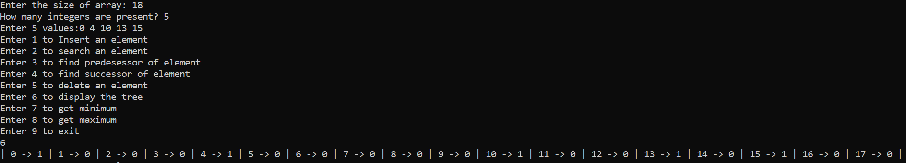

## User Instruction
- Compile and run the "main.c" file.
- First it will ask for the size of the array. It is basically the asking for the maximum number you want to enter. If you provide an integer M as input, the tree can store the numbers from 0 to M-1.
- After that, it will ask you that how many integers are present. Enter the number of elements present (let it be N).
- After that, enter N integers. Remember that you can not insert any number less than zero or greater than equal to M.
- After this, you can perform following operations on the tree:
    - Insert - You can insert any element from 0 to M-1 to the tree. Time Complexity = O(log(log(M))).
    - Search - You can check whether an element is present or not. Time Complexity = O(log(log(M))).
    - Predecessor - You can find the predecessor of any number from 0 to M-1. If there is no predessor present then it will print "no predecessor". Time Complexity = O(log(log(M))).
    - Successor - You can find the successor of any number from 0 to M-1. If there is no successor present then it will print "no successor". Time Complexity = O(log(log(M))).
    - Delete - You can delete any element from the tree. Time Complexity = O(log(log(M))).
    - Display - It will display all the elements as a binary array which will tell that whether an element is present or absent.
    - Min - Provides the minimum element. Time Complexity = O(1).
    - Max - Provides the maximum element. Time Complexity = O(1).

An example input and output is shown below:

